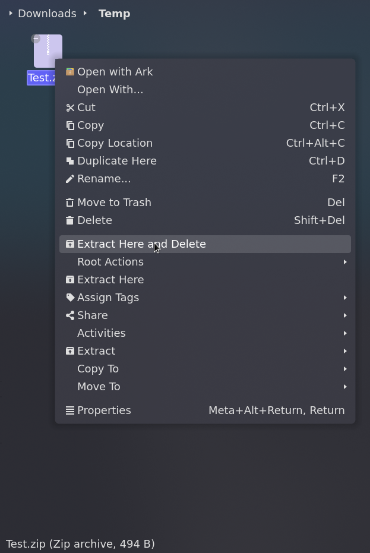

Service Menu for KDE's Dolphin file manager that adds a "Extract Here and Delete" command to the top level context menu.

This command uses the Ark utility to extract an archive in the current directory and then deletes the archive file it just extracted from.

